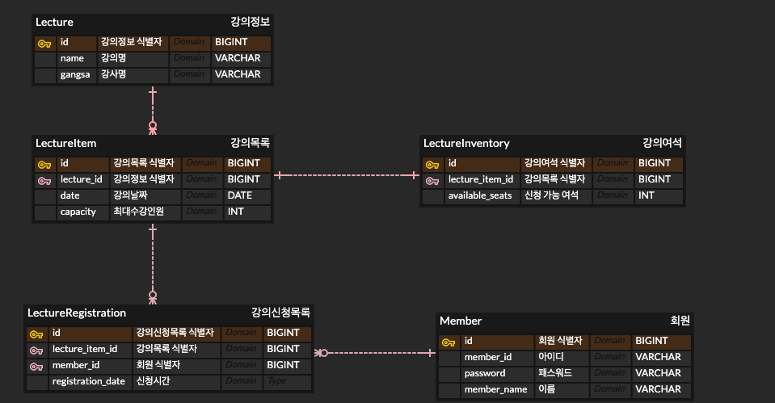

# 특강신청 ERD Report

---

### 1. **Member 테이블**
- **목적**: `member` 테이블은 사용자의 정보를 저장합니다. 이 테이블을 통해 시스템은 서로 다른 사용자를 구분할 수 있으며, `password`를 사용하여 인증 절차를 처리하고, `member_name`을 통해 개인화된 서비스를 제공합니다.
- **주요 필드**:
    - `id`: 각 사용자를 고유하게 식별하는 기본 키입니다.
    - `member_id`: 사용자 고유의 ID로, 중복을 방지하기 위해 UNIQUE 제약 조건이 설정되어 있습니다.
    - `password`: 사용자 인증을 위한 비밀번호입니다.
    - `member_name`: 사용자의 이름으로, 시스템에서 사용자에게 개인화된 경험을 제공하는 데 사용됩니다.

### 2. **Lecture 테이블**
- **목적**: `lecture` 테이블은 개별 강좌 정보를 저장합니다. 강의의 이름(`name`)과 강사 이름(`gangsa`)이 저장되며, 여러 강의가 있을 수 있기 때문에 각 강의는 고유한 ID를 가집니다.
- **주요 필드**:
    - `id`: 각 강의를 구별하는 기본 키입니다.
    - `name`: 강의의 이름으로, 강좌 목록을 표시하거나 조회할 때 사용됩니다.
    - `gangsa`: 강사의 이름으로, 강의의 추가 정보를 제공하기 위해 사용됩니다.

### 3. **LectureItem 테이블**
- **목적**: `lecture_item` 테이블은 각 강의의 세부 항목을 저장합니다. 하나의 강의는 여러 날짜에 걸쳐 진행될 수 있기 때문에, `lecture_item` 테이블은 개별 날짜와 정원을 저장하여 관리합니다.
- **주요 필드**:
    - `id`: 각 강의 항목을 식별하는 기본 키입니다.
    - `lecture_id`: 해당 항목이 속한 강의를 나타내며, `lecture` 테이블과 외래 키 관계를 가집니다.
    - `date`: 강의가 진행되는 날짜를 저장합니다.
    - `capacity`: 각 강의 항목의 최대 수강 인원을 지정하여 정원을 관리합니다.

### 4. **LectureInventory 테이블**
- **목적**: `lecture_inventory` 테이블은 각 강의 항목에 대해 남아 있는 수강 가능 인원을 추적합니다. 이는 수강 신청 시 실시간으로 인원을 관리하는 데 필수적인 역할을 합니다.
- **주요 필드**:
    - `id`: 각 재고 항목을 식별하는 기본 키입니다.
    - `lecture_item_id`: 해당 재고 항목이 어떤 강의 항목에 속하는지를 나타내며, `lecture_item` 테이블과 외래 키 관계를 가집니다.
    - `available_seats`: 남아 있는 수강 가능 인원을 저장합니다. 수강 신청 시 이 값이 감소하여 정원이 관리됩니다.

### 5. **LectureRegistration 테이블**
- **목적**: `lecture_registration` 테이블은 사용자가 각 강의에 대한 수강 신청 내역을 저장합니다. 이를 통해 누가 어떤 강의를 언제 신청했는지에 대한 기록을 관리할 수 있습니다.
- **주요 필드**:
    - `id`: 각 수강 신청 내역을 구분하는 기본 키입니다.
    - `member_id`: 해당 수강 신청을 한 사용자를 나타내며, `member` 테이블과 외래 키 관계를 가집니다.
    - `lecture_item_id`: 사용자가 수강 신청한 강의 항목을 나타내며, `lecture_item` 테이블과 외래 키 관계를 가집니다.
    - `registration_date`: 수강 신청이 이루어진 날짜 및 시간을 기록합니다.

---

### **설계 의도**
1. **정규화**: 이 설계는 데이터를 효율적으로 관리하기 위해 3차 정규화를 따릅니다. 각 테이블은 독립적인 데이터를 보유하며 중복을 최소화하였습니다. 예를 들어, `lecture_item`과 `lecture_inventory`는 강의 항목과 재고를 각각 관리하여 데이터의 무결성을 유지합니다.

2. **참조 무결성**: 외래 키 제약 조건을 사용하여 테이블 간의 관계를 명확히 하고, 잘못된 데이터가 삽입되는 것을 방지합니다. 예를 들어, `lecture_registration` 테이블의 `member_id`와 `lecture_item_id`는 각각 `member` 및 `lecture_item` 테이블을 참조하여 무결성을 유지합니다.

3. **효율적인 데이터 관리**: `available_seats` 필드를 통해 실시간으로 수강 신청 가능한 좌석을 추적하여, 수강 신청 시 정원 초과를 방지하고, 시스템의 효율성을 높였습니다.

4. **사용자 경험 향상**: `lecture_registration` 테이블을 통해 사용자는 자신이 수강 신청한 강의를 조회할 수 있으며, 이를 바탕으로 더 나은 학습 경험을 제공합니다.

